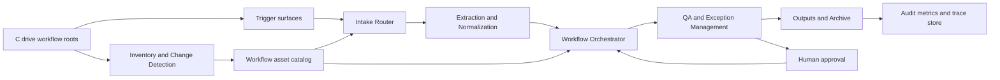
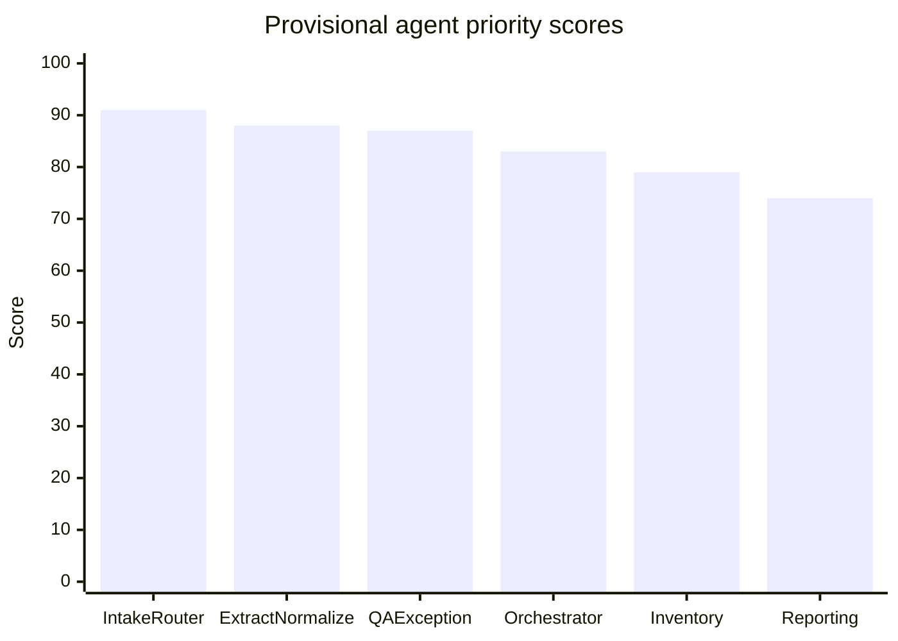
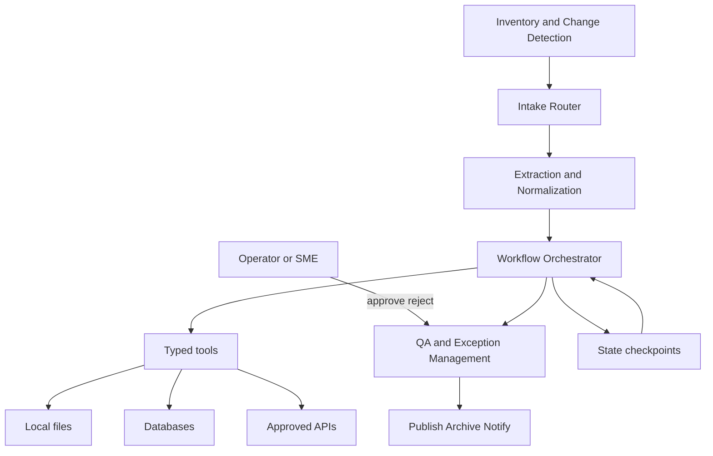
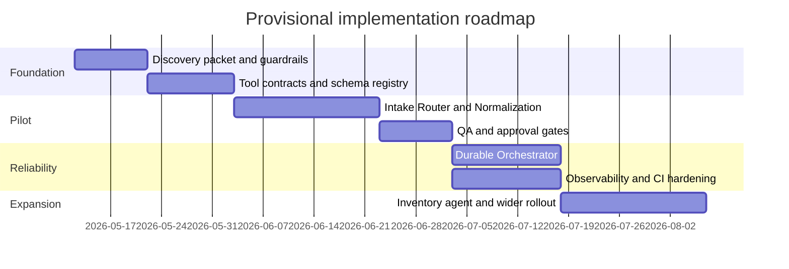

# Autonomous Agent Development Blueprint for a Windows Workflow on C Drive

## Executive summary

This report is a rigorous implementation blueprint, not a verified filesystem assessment, because no directory export, file listing, or direct access to the user’s `C:\` workflow has been provided. Under that constraint, the most defensible pattern is **bounded autonomy**: inventory the workflow first, expose existing scripts and data stores through typed tools and resources, persist state across steps, require human approval before irreversible actions, and instrument every run. That approach is strongly supported by the current agent ecosystem: the OpenAI Responses API supports function calling and built-in tools; the OpenAI Agents SDK adds managed turns, guardrails, handoffs, sessions, human-in-the-loop, and built-in tracing; MCP standardizes how local files, databases, and tools are exposed to AI systems; LangGraph supports durable execution and pause/resume interrupts; and Temporal is designed for crash-proof workflow continuation across failures and restarts. citeturn0search0turn12view2turn12view3turn12view4turn13view0turn13view2turn13view3turn10view2turn10view3turn10view4turn18view0turn18view1turn18view2

From a risk perspective, local Windows workflows are especially exposed to prompt injection through documents and logs, sensitive information disclosure from locally stored files, improper output handling when agent output is passed to scripts or macros, excessive agency if an agent can write broadly under `C:\`, and software supply-chain drift in the toolchain. NIST’s AI RMF and Generative AI Profile emphasize trustworthiness, testing/validation, and lifecycle risk management, while OWASP’s 2025 LLM Top 10 explicitly calls out prompt injection, sensitive information disclosure, supply-chain risk, improper output handling, excessive agency, misinformation, and unbounded consumption. The consequence is practical: the first production agents should be **Intake Router**, **Extraction and Normalization**, **QA and Exception Management**, **Workflow Orchestrator**, and **Inventory and Change Detection**—in that order of business value and controllability. citeturn7search1turn7search2turn7search5turn7search7turn21view0turn21view1turn20view0

The default recommendation is a **Python-first implementation** unless the existing workflow is already materially .NET-heavy. In the Python-first path, the core stack is: OpenAI Responses API or Agents SDK for model interaction, MCP for portable tool/resource contracts, LangGraph first or Temporal when stronger durability is required, Pydantic and FastAPI for typed boundaries, Watchdog for filesystem triggers, DuckDB and Parquet for local analytical/state artifacts, Playwright for browser automation, Power Automate Desktop for GUI-only Windows surfaces, OpenTelemetry for traces, and GitHub Actions running on self-hosted Windows runners for CI/CD and validation. For .NET-heavy workflows, Semantic Kernel, FileSystemWatcher, and Windows-native scheduling become the natural substitutes or complements. citeturn14view0turn14view1turn14view2turn10view6turn10view5turn1search0turn10view16turn25search0turn10view18turn10view10turn11view1turn17view0turn14view7

## Evidence boundaries and discovery method

The current unknowns are decisive: the workflow domain, the exact Windows version, the existing code languages, whether the process is script-driven or GUI-driven, what the authoritative triggers are, where outputs land, and what security policy governs local data. Until those facts are supplied, any path-level “discovered files/folders” list would be speculative. The right first move is therefore to collect a **discovery packet** from the machine: approved workflow root paths, a two- to three-level directory tree, extension counts, recent file modification history, scheduled task metadata, redacted config filenames, sample inputs and outputs, and representative logs. That packet becomes the evidence base for replacing provisional mappings with verified ones.

On Windows, trigger sources commonly live in three places. First, **Task Scheduler** runs tasks when configured trigger criteria are met. Second, **filesystem watchers** can react to new or changed files: .NET’s `FileSystemWatcher` listens for changes to files and directories and exposes controls like `NotifyFilter` and `InternalBufferSize`, while Python’s Watchdog offers a cross-platform filesystem event API. Third, when a workflow depends on desktop UI rather than files or APIs, **Power Automate desktop flows** can automate repetitive desktop processes across files, folders, Excel, browsers, and legacy applications. citeturn10view5turn10view6turn16view1turn16view2turn1search0turn16view3turn11view1

*The table below is therefore a provisional discovery matrix to populate once the user provides filesystem exports.*

| Artifact class to verify | Typical path or pattern to look for | Inferred purpose | Candidate agent mapping | Current status |
|---|---|---|---|---|
| Workflow roots | `C:\Work\...`, `C:\Users\<user>\Documents\...`, shared sync folders | Top-level process boundaries and ownership | Inventory and Change Detection | Awaiting export |
| Intake folders | `input\`, `inbox\`, `drop\`, `imports\`, `exports\incoming\` | Entry points for new work items | Intake Router | Awaiting export |
| Script entry points | `scripts\*.py`, `*.ps1`, `*.bat`, `*.cmd`, `*.exe` | Existing automations to wrap as tools | Workflow Orchestrator | Awaiting export |
| Business logic source | `src\`, `app\`, solution/project files, package manifests | Core reusable logic and dependencies | Workflow Orchestrator | Awaiting export |
| Config and rules | `config\*.yaml`, `settings.json`, `.env`, templates, rule files | Environment bindings, routing, thresholds, mappings | Extraction and Normalization; QA and Exception Management | Awaiting export |
| Data stores | `*.db`, `*.sqlite`, `*.accdb`, `*.parquet`, `*.csv`, `*.xlsx` | Source-of-truth or intermediate state | Extraction and Normalization | Awaiting export |
| Logs and audit trails | `logs\*.log`, trace files, exported event logs | Failure analysis, trigger confirmation, SLAs | QA and Exception Management | Awaiting export |
| Output folders | `output\`, `reports\`, `archive\`, `published\` | Completion artifacts and quality checks | QA and Exception Management | Awaiting export |
| Tests and specs | `tests\`, `specs\`, fixtures, golden files | Reusable acceptance criteria | QA and Exception Management | Awaiting export |
| Scheduling artifacts | Exported scheduled tasks, startup scripts, service definitions | Time-based or event-based automation | Intake Router; Workflow Orchestrator | Awaiting export |

If the workflow turns out to be GUI-heavy, the safest Windows-native first choice is usually Power Automate Desktop, which Microsoft positions for repetitive desktop process automation. By contrast, WinAppDriver is documented by Microsoft as a **UI test automation service** and is still labeled **beta**, so it is better treated as a niche legacy option for test harnesses than as the primary automation backbone. citeturn11view1turn22view2



A minimal evidence package can be exported without granting broad write access. A practical starting point is:

```powershell
$roots = @("C:\Path\To\WorkflowRoot")
Get-ChildItem $roots -Recurse -Force -ErrorAction SilentlyContinue |
  Select-Object FullName, PSIsContainer, Extension, Length, LastWriteTime |
  Export-Csv .\filesystem_inventory.csv -NoTypeInformation

Get-ScheduledTask |
  Select-Object TaskPath, TaskName, State |
  Export-Csv .\scheduled_tasks.csv -NoTypeInformation
```

That export should be run only against approved roots, with secrets redacted before sharing.

## Opportunity map and prioritization

The central architectural insight is that most local workflow automation opportunities do **not** start with an end-to-end “super agent.” They start with repeatable handoffs: detecting the right trigger, classifying new work, normalizing inputs into a stable schema, calling well-bounded existing scripts or APIs, and enforcing quality gates before publication or side effects. Durable orchestration and human approval become more important as soon as those handoffs span multiple steps, machines, or business consequences. That is precisely where managed runtimes, typed tool invocation, tracing, interrupts, and resumable workflow engines add value. citeturn13view0turn13view2turn10view2turn10view3turn17view3turn18view1

The prioritization below is a **provisional analytical score** based on impact, feasibility, and controllability, not on verified path-level evidence. It should be recalibrated after the discovery packet is supplied.

| Candidate agent | Primary value | Impact | Feasibility | Controllability | Priority score |
|---|---|---:|---:|---:|---:|
| Intake Router | Converts raw triggers into reliable work items and deduplicated jobs | 5 | 4 | 5 | 91 |
| Extraction and Normalization | Removes manual parsing and schema drift from the workflow entry point | 5 | 4 | 4 | 88 |
| QA and Exception Management | Prevents bad outputs, routes edge cases, and preserves human oversight | 5 | 4 | 4 | 87 |
| Workflow Orchestrator | Coordinates existing scripts, approvals, retries, and side effects | 5 | 3 | 4 | 83 |
| Inventory and Change Detection | Builds the asset map and tracks what changed when workflows drift | 4 | 4 | 4 | 79 |
| Reporting and Audit | Produces operational dashboards, SLA views, and audit evidence | 3 | 4 | 5 | 74 |



The ranking favors **entry-point control** over late-stage automation because bad routing, inconsistent parsing, and silent failures are what usually make local workflows brittle. Once those are stable, orchestration and auditability become easier to industrialize.

## Top agent design documents

All five designs below assume that existing scripts, services, and path-level actions are wrapped as **typed tools** with JSON-schema or Pydantic-validated arguments; that important local context can be exposed through MCP resources if needed; and that multi-step jobs can be paused, resumed, or replayed safely. Those assumptions line up with OpenAI function calling, Pydantic validation, MCP tool/resource schemas, LangGraph interrupts, and Temporal’s durable workflow model. citeturn12view2turn13view0turn25search0turn25search2turn25search5turn18view0turn18view1turn18view2turn10view3turn17view3

**Inventory and Change Detection**

| Design field | Specification |
|---|---|
| Mission | Build and continuously refresh an asset catalog of workflow files, scripts, configs, schedules, data sources, and outputs under approved roots. |
| Inputs | Approved root paths; file metadata; extension/type heuristics; scheduled task export; recent logs; package manifests; hashes where allowed. |
| Outputs | Asset catalog; dependency graph; “suspected entry point” list; change alerts; configuration drift report. |
| Preconditions | Read-only access to approved roots only; path allowlist; secret-value suppression; naming conventions where available. |
| Success criteria | At least one authoritative catalog row for every script, config, input folder, output folder, and scheduler entry under approved roots; reproducible reruns; delta reports that explain added, changed, and removed assets. |
| Error handling | Skip access-denied paths and log them separately; back off on locked files; fall back from event-driven updates to scheduled rescans when watcher integrity is uncertain. |
| Security and privacy constraints | Never ingest raw secrets into prompts; hash or classify secret-bearing files without exposing contents; no write permission under discovery mode. |
| Candidate mappings | Workflow roots, `src\`, `scripts\`, `config\`, `tests\`, logs, and scheduled task exports. |

Event deduplication is important here. Filesystem events may be synthesized or incomplete, and some move/copy patterns can surface as folder renames rather than clean file-by-file updates, so the agent should combine event-based and scheduled reconciliation rather than trusting raw watcher notifications alone. citeturn16view3turn16view4

**Intake Router**

| Design field | Specification |
|---|---|
| Mission | Turn incoming file, schedule, or desktop/UI events into canonical work items and route them to the correct downstream process. |
| Inputs | Filesystem events; scheduled task triggers; user drop folders; optional desktop-flow outputs; asset catalog from the Inventory agent. |
| Outputs | Routed work item; dedupe key; source classification; job priority; queue assignment; initial provenance record. |
| Preconditions | Known trigger sources; route table; file/path allowlist; idempotency key design; source-to-workflow mappings. |
| Success criteria | No duplicate job creation for the same logical file or event; every accepted trigger mapped to a known workflow or rejected with a clear reason; source metadata preserved. |
| Error handling | Dead-letter queue for unknown inputs; debounce rapid file-save storms; fallback scan when a watcher buffer overflows or a scheduled export is delayed. |
| Security and privacy constraints | Accept only approved directories, extensions, and sender/system identities; quarantine untrusted or unsupported inputs. |
| Candidate mappings | `input\`, `inbox\`, export drops, scheduled task invocations, browser download folders, and handoff directories. |

**Extraction and Normalization**

| Design field | Specification |
|---|---|
| Mission | Parse raw workflow inputs into a stable internal schema so downstream agents operate on typed, validated data rather than ad hoc filenames and spreadsheets. |
| Inputs | CSV, Excel, database extracts, text documents, logs, PDFs, and structured exports from upstream systems. |
| Outputs | Canonical JSON or row-structured records; validation report; rejected-record bundle; normalized metadata and lineage. |
| Preconditions | Declared schema or target contract; parser registry by file type; validation rules; domain-specific field mappings. |
| Success criteria | Known formats parse deterministically; invalid records are quarantined with exact reasons; schema drift is detected and surfaced before execution. |
| Error handling | Distinguish parser failure from validation failure; preserve failed source files for replay; route unknown formats to human review. |
| Security and privacy constraints | Redact sensitive fields before any model step that is not strictly required; do not persist raw secrets; classify files before agentic reasoning. |
| Candidate mappings | `*.csv`, `*.xlsx`, `*.sqlite`, `*.db`, exports, report extracts, and database snapshots. |

**Workflow Orchestrator**

| Design field | Specification |
|---|---|
| Mission | Execute the end-to-end workflow by calling approved scripts, APIs, and local actions in the correct order with checkpoints, retries, and approval gates. |
| Inputs | Normalized work item; tool registry; execution state; approval signals; retry policy; runbook metadata. |
| Outputs | Completed artifacts; state checkpoints; activity log; retry summary; compensation actions if supported. |
| Preconditions | Existing scripts or services wrapped as tools; explicit side-effect boundaries; idempotency strategy; durable state store. |
| Success criteria | Can resume after process restarts; external writes occur only after preconditions and approvals; retries do not create duplicate side effects; every step has trace metadata. |
| Error handling | Retry transient failures; halt and request review on ambiguous output; support compensation or rollback when downstream writes partially succeed. |
| Security and privacy constraints | Least-privilege execution account; write access limited to approved paths and APIs; explicit denylist for destructive filesystem actions. |
| Candidate mappings | `scripts\*.py`, `*.ps1`, `*.bat`, local CLIs, API clients, scheduler tasks, and file publication steps. |

This is where durable orchestration matters most. LangGraph can persist graph state and pause for human input, while Temporal is designed to recreate workflow state after crashes and continue from recorded history. For workflows with high business consequence or long-running waits, that is the difference between operational reliability and silent drift. citeturn10view2turn10view3turn10view4turn17view3

**QA and Exception Management**

| Design field | Specification |
|---|---|
| Mission | Validate outputs, detect anomalies, enforce business rules, and escalate uncertain or failed cases to humans with evidence attached. |
| Inputs | Intermediate outputs; final artifacts; logs; thresholds; rule files; historical goldens; test fixtures. |
| Outputs | Pass/fail decisions; annotated exception packets; approval requests; remediation guidance; audit trail. |
| Preconditions | Explicit acceptance criteria; expected output formats; golden examples; severity model; escalation targets. |
| Success criteria | Defects are caught before publication; each rejection includes actionable reasons; human reviewers receive enough context to decide quickly. |
| Error handling | Quarantine invalid outputs; prevent unsafe automatic retries; classify failure as data issue, tool issue, environment issue, or policy issue. |
| Security and privacy constraints | Never execute unvalidated model output; mask sensitive evidence in review packets; retain only policy-allowed audit data. |
| Candidate mappings | `tests\`, `rules\`, `output\`, `archive\`, logs, comparison baselines, and reviewer inboxes. |

This agent is the primary defense against **improper output handling** and **excessive agency**, both of which OWASP explicitly flags for LLM systems. It should sit in front of every irreversible publish, delete, move, email, or external system write. citeturn21view1turn21view0

## Architecture and tooling recommendations

For most Windows workflow modernizations, the strongest default architecture is: **typed tools around existing assets, durable orchestration for multi-step work, separate trigger detection from business execution, and explicit human approval at write boundaries**. Exposing local capabilities via MCP can prevent framework lock-in, because the same resource/tool server can be used by different agent runtimes later. MCP’s own tool specification recommends a human in the loop with clear confirmation for operations, which fits enterprise-local workflows very well. citeturn18view0turn18view1



| Layer | Recommended choice | Why this is the default |
|---|---|---|
| Model interaction | OpenAI Responses API plus OpenAI Agents SDK | Use the Responses API when you want to own the loop and tool dispatch; use the Agents SDK when you want managed turns, guardrails, handoffs, sessions, human-in-the-loop, and tracing. citeturn10view1turn13view0turn13view2turn13view3 |
| Tool and resource contract | MCP | MCP provides a standard way to expose tools and resources, including local files and databases, with explicit schemas and discovery semantics. citeturn10view19turn18view0turn18view1turn18view2 |
| Short-to-medium orchestration | LangGraph | Durable execution plus interrupt-based human approval makes it a strong fit for pilot workflows and review gates. citeturn10view2turn10view3 |
| High-durability orchestration | Temporal | Use when jobs must survive crashes, outages, or long waits and resume from recorded history. citeturn10view4turn17view3 |
| Trigger handling | Watchdog or .NET FileSystemWatcher plus Task Scheduler | Watchdog gives cross-platform file events; FileSystemWatcher is Windows-native; Task Scheduler covers time/event based execution. citeturn1search0turn10view6turn10view5 |
| Validation and contracts | Pydantic plus FastAPI | Pydantic provides typed validation and validators; FastAPI uses Python type hints and Pydantic to build APIs and internal service endpoints quickly. citeturn25search0turn25search2turn25search5turn10view16 |
| Local analytical/state store | DuckDB and Parquet | Efficient local read/write on Parquet and good fit for asset catalogs, replay sets, and QA evidence packs. citeturn10view18 |
| Browser automation | Playwright | Auto-waiting and retries reduce flaky automation for web-facing workflow steps. citeturn10view10turn22view0 |
| Desktop automation | Power Automate Desktop | Best fit when a required system has no usable file or API surface and the workflow depends on Windows UI interactions. citeturn11view1 |
| Observability | OpenTelemetry plus OpenAI traces | OpenTelemetry provides traces, metrics, and logs; the OpenAI Agents SDK also auto-generates agent traces for review. citeturn10view14turn17view0turn13view3 |
| CI/CD and quality gates | GitHub Actions on self-hosted Windows runners | GitHub Actions supports CI/CD, matrix runs, caching, and self-hosted runners for local network, Windows-specific, or desktop-bound tests. citeturn10view12turn14view5turn14view6turn14view7 |
| Security scanning | Semgrep and Bandit | Semgrep covers SAST, SCA, secrets, and CI integration; Bandit scans Python ASTs for common security issues. citeturn10view15turn17view1turn23view0 |
| Packaging and dev ergonomics | uv and Ruff | `uv` is a fast Python package/project manager; Ruff combines very fast linting and formatting with `pyproject.toml` support. citeturn14view3turn14view4 |
| Supply-chain hardening | Docker multi-stage builds, SLSA, Sigstore Cosign | Multi-stage builds reduce production image surface; SLSA gives a framework for artifact integrity; Cosign supports signing and verification with transparency log evidence. citeturn10view13turn22view1turn14view8turn24view0turn24view1 |

If the existing workflow is already centered on PowerShell, C#, or .NET services, the main substitution is straightforward: use **Semantic Kernel** for agents and plugins, keep FileSystemWatcher and Task Scheduler on the trigger side, and preserve the same bounded-autonomy model. Semantic Kernel’s plugin model is explicitly designed to encapsulate existing APIs and expose them to agents through function calling, which makes it well-suited to wrapping an existing Windows automation estate rather than rewriting it. citeturn14view0turn14view1turn14view2

For secrets on a Windows-local deployment, prefer an external secret manager where available; if the workflow must remain local-first, use Windows data protection or equivalent machine/user-bound protection rather than storing plaintext tokens in config files. Microsoft’s DPAPI is specifically designed so that protected data is typically decryptable only by the same user credential on the same computer. citeturn10view7

## Roadmap, testing, and risk management

The roadmap below assumes one to two engineers, one workflow SME, and part-time IT/security review. It also assumes that the first release targets a **single workflow slice**, not the entire drive.

| Phase | Focus | Concrete milestone artifacts | Estimated effort | Dependencies |
|---|---|---|---|---|
| Discovery and guardrails | Build evidence base and minimum controls | Approved roots; filesystem inventory; scheduled task export; tool allowlist; data classification; redaction rules | 1–2 weeks | User supplies discovery packet |
| Platform skeleton | Stand up typed tool wrappers and state model | MCP or function-tool contracts; schema registry; state store; trace IDs; approval model | 2–3 weeks | Discovery complete |
| Pilot workflow slice | Automate one high-volume, low-ambiguity process | Intake Router, Extraction and Normalization, QA and Exception Management for one slice | 3–5 weeks | Platform skeleton |
| Durable execution and approvals | Add restart safety and side-effect controls | Orchestrator with checkpoints, retries, approval gates, dead-letter handling | 2–4 weeks | Pilot slice stable |
| Production hardening | CI/CD, observability, security, replay testing | Self-hosted Windows runner, matrix tests, traces, scanners, signed artifacts, rollback plan | 2–3 weeks | Orchestrator in place |
| Scale-out | Add Inventory and Change Detection and expand coverage | Asset catalog, change alerts, wider workflow mappings, second and third workflow slices | 3–6 weeks | Production hardening |



Testing and validation should be treated as a first-class deliverable, not a cleanup step. Use `pytest` fixtures and auto-discovery for unit and integration tests; add golden-file replay tests so historical workflow cases can be rerun after prompt, rule, or parser changes; use Playwright for browser-based steps with auto-waiting and retries; run CI on a self-hosted Windows runner when local apps, private network resources, or desktop dependencies are involved; and instrument every run with OpenTelemetry plus OpenAI trace views. Security gates should include Semgrep and Bandit in CI, while release artifacts should be built with Docker multi-stage images where applicable, then signed and verified with Cosign, with a gradual path toward SLSA-style provenance. citeturn10view11turn10view10turn22view0turn14view7turn10view14turn13view3turn17view1turn23view0turn10view13turn24view0turn24view1turn14view8

The risk picture is clear even before the workflow inventory arrives. The most important issues are not “which model” but **what the agent is allowed to touch, what evidence it sees, and how human review is inserted**. OWASP’s 2025 risk taxonomy and NIST’s AI RMF/GAI profile provide a strong baseline for that control set. citeturn21view0turn21view1turn7search1turn7search7

| Risk | Why it is acute for a local `C:\` workflow | Mitigation |
|---|---|---|
| Prompt injection from documents, logs, or filenames | Local files can contain instructions that attempt to hijack downstream agent behavior | Treat file content as untrusted; separate retrieval from execution; use QA gates before side effects; keep tools least-privileged |
| Sensitive information disclosure | Local drives often contain credentials, exports, archived reports, and user documents beyond the intended workflow scope | Restrict roots, redact before prompts, keep a denylist for secret-bearing paths, and prefer DPAPI or a vault for secrets |
| Improper output handling | Agent text can be accidentally fed into scripts, formulas, macros, or shell steps | Require strict schemas, validate outputs, and never execute free-form model output directly |
| Excessive agency | Broad write/delete/move permissions under `C:\` turn ordinary mistakes into destructive incidents | Use read-only discovery mode, write allowlists, approval gates, and service accounts with minimal ACLs |
| Trigger storms and duplicate execution | File watchers and saves can emit noisy or partial signals | Debounce, dedupe with idempotency keys, and reconcile event-driven runs with scheduled scans |
| Supply-chain weakness | Agent stacks bring additional libraries, containers, and CI artifacts into scope | Lock dependencies, scan in CI, sign artifacts, and maintain provenance evidence |
| GUI fragility | UI selectors, focus, sessions, or desktop state can change invisibly | Prefer API or file contracts first; reserve desktop automation for irreducible cases; keep GUI steps behind smoke tests |
| Incomplete current-state discovery | Missing one scheduler, config file, or side-effect script can invalidate the automation design | Require the discovery packet before broad rollout; expand from one confirmed workflow slice at a time |

The immediate evidence package to request from the user is concise and highly actionable: approved workflow root paths; a two- to three-level directory tree; a list of executable artifacts and scheduled tasks; one sanitized input/output example for the highest-volume workflow slice; redacted config filenames and variable names; and a representative failure case from logs. Once those are supplied, the provisional tables in this report can be converted into a verified, path-level implementation plan with much higher confidence.